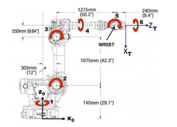

The Python version is available at
     https://github.com/petercorke/robotics-toolbox-python

- Set up the industrial manipulator depticted in Problem 5 of assignment 3 using the Robotics Toolbox (3 marks)
- Plot the manipulator in zero position. Your zero position should match configuration shown in figure. (2 marks)
- Make an animation of the robot arm moving from the zero position (one shown in figure) to one where the end-effector is at its maximum possible height (z0 value). (4 marks)

Industrial 3 DOF bot with DH parameters:

| Joint i | \theta  |  d_i  (mm) |  a_i  (mm) |  \alpha_i  (deg) |
|------------|------------|-------------|-------------|----------------|
| 1          |  \theta_1  | 740         | 305         | -90            |
| 2          |  \theta_2  | 0           | 1075        | 0              |
| 3          |  \theta_3  | 0           | 250         | -90            |
| 4          |  \theta_4  | 1275        | 0           | 90             |
| 5          |  \theta_5  | 0           | 240         | 90             |
| 6          |  \theta_6  | 0           | 0           | 0              |